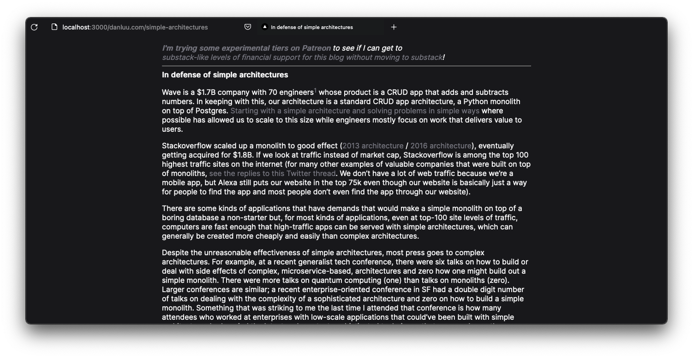

# reader

## Why?

I was bored

## What is this?

It'll try to scrape the website and show it to you with
my choice of color scheme/theme

## How do I use this?

Add your url without the `http` scheme after the domain.
so, if running locally and you wish to read a post from https://danluu.com/ then the url would look like below

```
http://localhost:3000/danluu.com/simple-architectures
```

Which would look a little something like this


## License

[MIT](license) 2022-Present [Reaper](github.com/barelyhuman)
